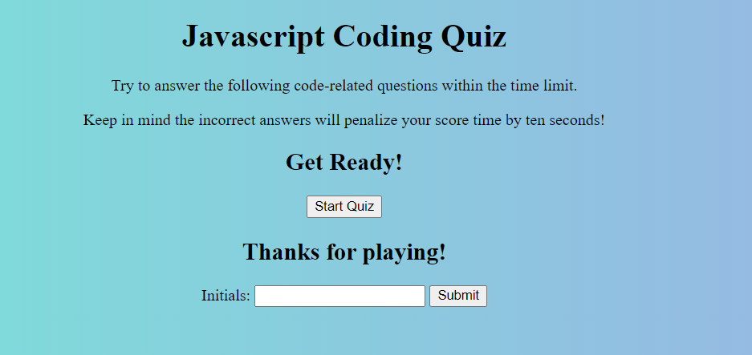

# coding-quiz

[link to live website](https://ro-galvan.github.io/coding-quiz/)

[link to GitHub repository](https://github.com/Ro-Galvan/coding-quiz)

# Description
This is a quiz that a user can take to test their JavaScript Knowledge. It is multiple choice and has a timer. The user gets penazlized if they select the wrong answer. 10 seconds will be subtracted from the timer. If the user runs out of time, before they answer 5 questions then the game is over. The user is also able to keep track of their past scores. Give it a try and see how well you can score!

# Visual

